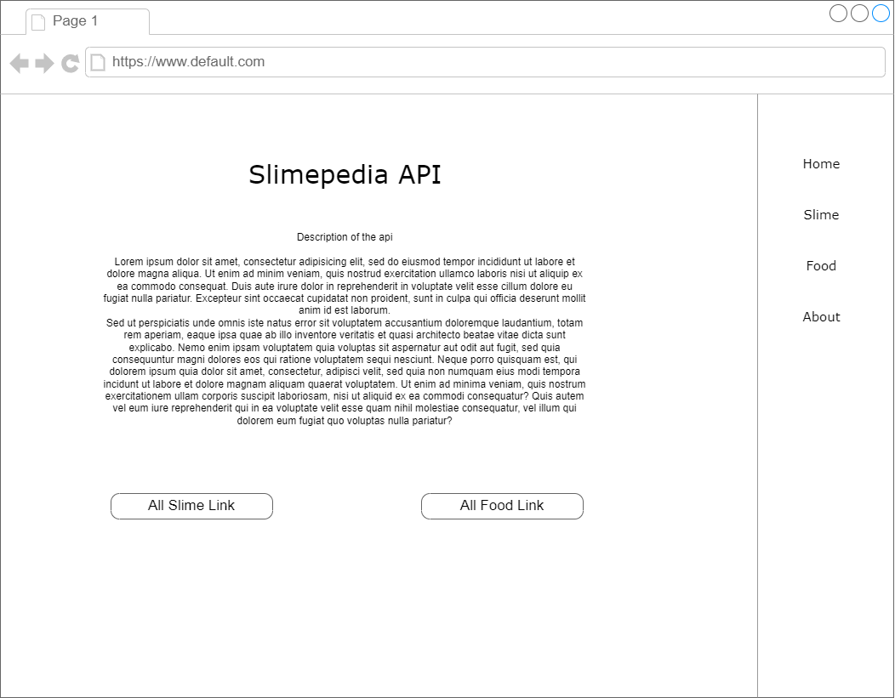
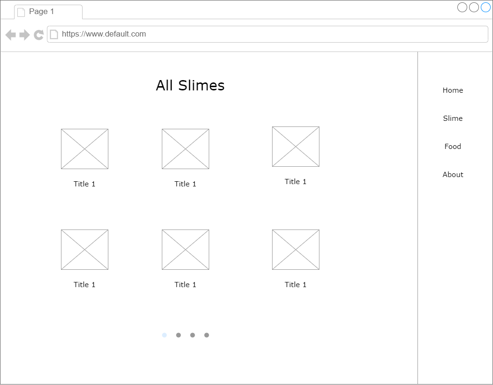
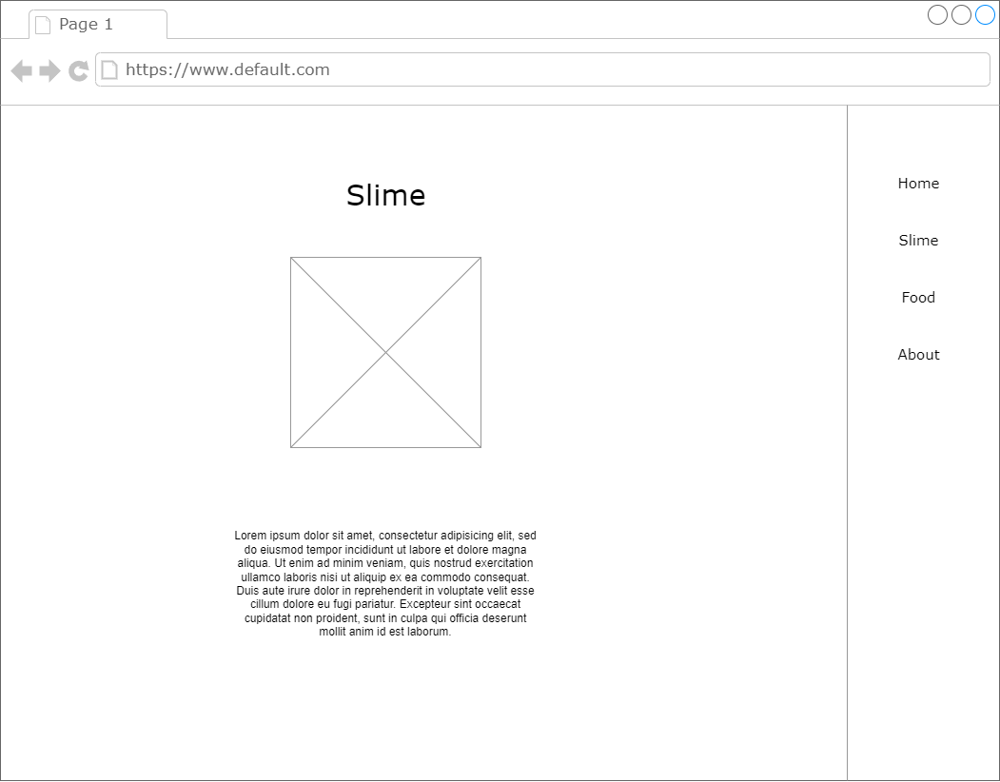
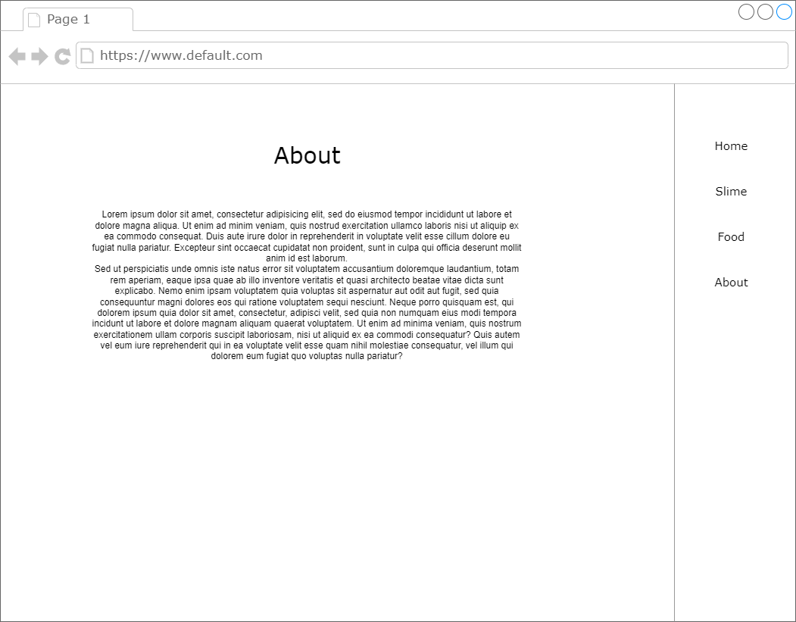
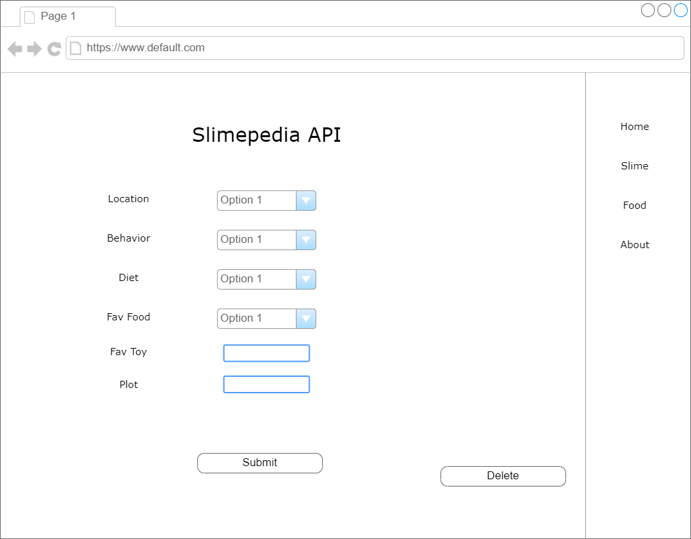

# Slimepedia API
API For the Dev to track slime and food info form Slime Rancher.

## Tech Being Used
* HTML
* CSS
* TypeScript
* Mongoose
* React
* Express
* Node.js

## ERD
* Slime : Food (1:1)

## Restful Routing Chart
| HTTP METHOD (_Verb_) | URL (_Nouns_) | CRUD   | Response                                     |
| -------------------- | ------------- | ------ | -------------------------------------------- |
| `Slimes`             |               |        |                                              |
| /slimes              | GET           | READ   | Displays all array slimes id and name        |
| /slimes/:id          | GET           | READ   | Displays a slime's info                      |
| /slimes/new          | GET           | READ   | Displays new slime form                      |
| /slimes              | POST          | CREATE | Create new slime and redirect new slime page |
| /slimes/:id/edit     | GET           | READ   | Displays edit form                           |
| /slimes/:id          | PUT           | EDIT   | Edit slime and redirect slime page           |
| /slimes/:id          | DELETE        | DELETE | Delete slime and redirect all Slime page     |
| `Foods`              |               |        |                                              |
| /foods               | GET           | READ   | Displays all food and id                     |
| /foods/:id           | GET           | READ   | Displays a food's info                       |
| /foods/new           | GET           | READ   | Displays new food form                       |
| /foods               | POST          | CREATE | Create new food and redirect new food page   |
| /foods/:id/edit      | GET           | READ   | Displays edit form                           |
| /foods/:id           | PUT           | EDIT   | Edit food and redirect food page             |
| /foods/:id           | DELETE        | DELETE | Delete food and redirect all food page       |
|                      |               |        |                                              |

## WireFrame

## User Stories
* As a user I want to be able to see a list of all Slimes/food in the database
* As a user I want to see the info of a Slime/Food
* As a user I want to CRUD Slimes/Food

## MVP Checklist
* Slime CRUD
* Food CRUD

## Stretch Goals
* Admin model
* User model
* User Auth
* Google oAuth
* Locactions : Slime(M:N) & Location : Food(M:N)

## Sprint Flow
### Sprint 1
* Finish planing api and react wireframes
* Learn TypeScript (YouTube, GeeksForGeeks, w3schools)
### Sprint 2
* Stub up app compents
* Simple css
### Sprint 3
* Slime and Food CR fucntionality
* Debug as needed
### Sprint 4
* Slime and Food UD functionality
* Debug as needed
### Sprint 5
* Code clean up
* ReadMe Clean up
### Sprint 6
* Refator
* Streach goals

## Maybe Roadblocks
* Feature creep
* Route mix up